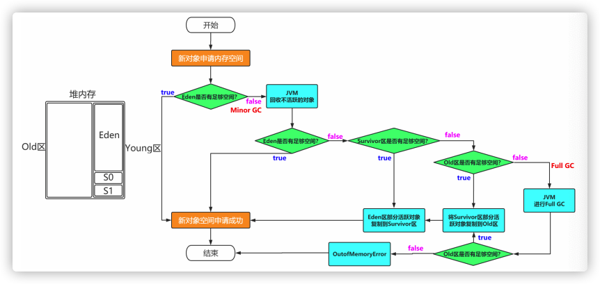
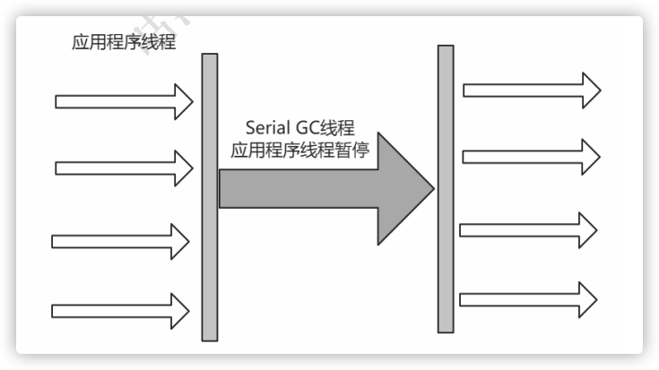
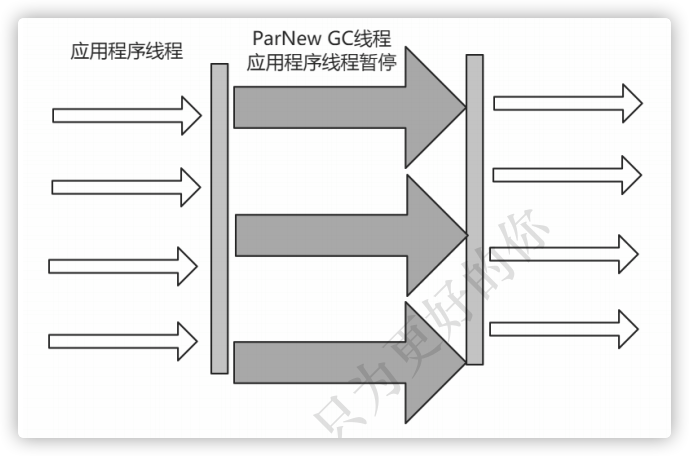
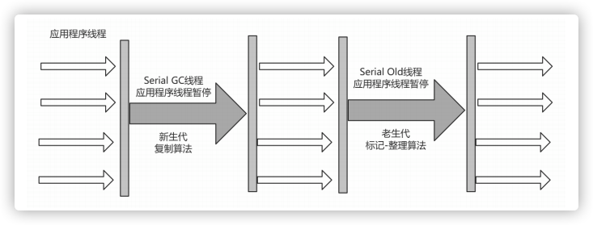
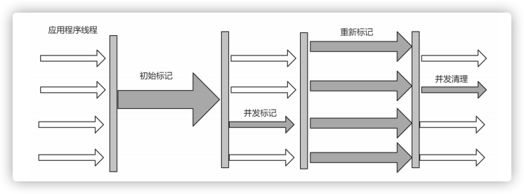
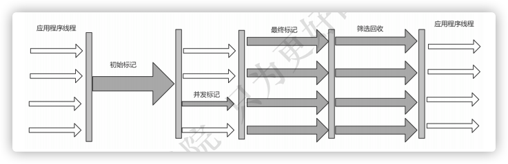
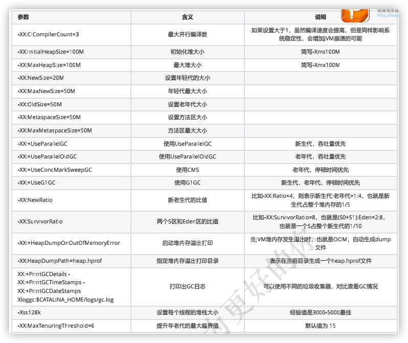
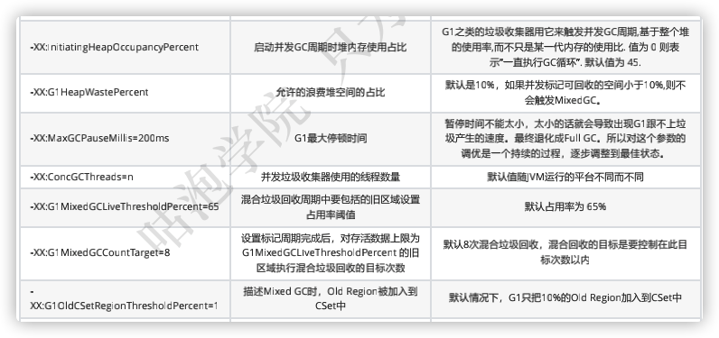

参考:

 [JVM进行篇笔记.pdf](JVM.assets/JVM进行篇笔记.pdf) 

 [JVM前奏篇笔记.pdf](JVM.assets/JVM前奏篇笔记.pdf) 

 [JVM升华篇笔记.pdf](JVM.assets/JVM升华篇笔记.pdf) 

 [JVM实战篇笔记.pdf](JVM.assets/JVM实战篇笔记.pdf) 

 [JVM终结篇笔记.pdf](JVM.assets/JVM终结篇笔记.pdf) 

### 虚拟机的类加载机制

1. 装载(Load)

   * 通过一个类的全限定名获取定义此类的二进制字节流
   * 将这个字节流所代表的静态存储结构转化为方法区中运行时数据结构
   * 在java堆中生成一个代表这个类的java.lang.Class对象, 作为对方法区中这些数据的访问入口

2. 链接(Link)

   1. 验证(Verify)

      文件格式, 元数据,字节码,引用符号的验证

   2. 准备(Prepare)

      为类的静态变量分配内存, 并将其初始化为默认值

   3. 解析(Resolve)

      把类中的符号引用转换为直接引用

3. 初始化(Initialize)

   对类的静态变量, 静态代码块执行初始化操作

### 什么是类加载器

在装载的第一步中, 需要通过类的全限定名获取其定义的二进制字节流, 这个过程需要借助类加载器来完成, 顾名思义, 就是用来加载Class文件的.

### 类加载器的分类

| 类加载器              | 加载目录                                                     | 说明                                                         |
| --------------------- | ------------------------------------------------------------ | ------------------------------------------------------------ |
| Bootstrap Classloader | $JAVA_HOME/jre/lib/rt.jar                                    | 由C++实现, 不是Classloader子类                               |
| Extension Classloader | $JAVA_HOME/jre/lib/*.jar或-Djava.ext.dirs指定目录下的jar包   | 负责加载java平台中扩展功能的一些jar包                        |
| App Classloader       | classpath中指定的jar包或-Djava.class.path所指定目录下的类和jar包 |                                                              |
| Custom Classloader    | 自定义                                                       | 通过java.lang.ClassLoader的子类自定义加载class,属于应用程序根究自身需要自定义的装载器 |

### 虚拟机类加载原则

* 检查顺序: 检查一个类是否被加载, 顺序是自下向上.
* 加载顺序: 加载一个类的顺序, 顺序是自上向下.

什么是双亲委派机制

如果一个类加载器在接到一个类加载的请求时, 它首先不会自己去加载这个类, 而是先把这个请求任务委托给自己的父类去完成, 依次递归, 如果父类加载可以完成这个类的加载任务, 就成功返回, 如果这个父类加载器无法完成此任务时, 就自己去加载.

> 优点:使java中的对象有了加载的优先级, 可以有效控制重复加载的问题

### 运行时数据区的划分

1. 方法区(Method Area)

   > 方法区是线程共享的内存区域, 是虚拟机启动时创建的
   >
   > 存储已被虚拟机加载的类信息, 常量, 静态变量, 及时编译器编译的代码等数据
   >
   > 是堆的逻辑区域, 如果无法满足分配需求, 将抛出OutOfMemoryError
   >
   > JDK1.8中将Metaspace, 之前叫:Perm Space

   > Class文件中除了有类的版本, 字段, 方法, 接口等描述信息外, 还有一项信息就是常量池, 用于存放编译时期生成的各种字面量和符号引用. 这部分内容将在类加载后进入方法区的运行时常量池中存放

2. 堆(Heap)

   > 堆是线程共享的, 在虚拟机启动时创建
   >
   > java对象及数组都是在堆上分配的, 是java虚拟机中所管理内存最大一块

3. 虚拟机栈(Java Virtual Machine Stacks)

   > 用来保存java线程的运行状态的区域
   >
   > 一个方法调用形成一个栈帧,执行完一个方法, 弹出该栈帧

4. 本地方法栈(Native Method Stacks)

   > 如果线程当前执行的是Native类型的, 这些方法会在本地方法栈中执行

5. 程序计数器(The PC Register)

   > 用来记录cpu切换线程时的线程执行状态
   >
   > 如果该线程正在执行java线程, 则用来记录当前虚拟机中字节码指令地址
   >
   > 如果正在执行的是native 方法, 这个计数器为空

### java虚拟机栈的栈帧具体包含哪些内容

1. 局部变量表(Local Variables)

    方法中定义的局本部变量及方法的参数存放在这张表中

    > 局部变量表中的变量不可以直接使用, 如需要使用的话, 必须通过相关指令将其加载至操作数栈中作为操作数使用

2. 操作数栈(Operand Stack)

    以压栈与出栈的方式存储操作数

3. 动态链接(Dynamic Linking)

    每个栈帧中都包含一个指向运行时常量池中该栈帧所属方法的引用, 持有这个引用是为了支持方法调用过程中的动态链接.(A reference to the run-time constant pool)

4. 方法返回地址(Return Address)

    当一个方法开始执行后, 只有两种方式可以退出, 一种是遇到方法返回的字节码指令, 一种是遇见异常, 并且这个异常没有在方法体内得到处理.

### 运行时内存的引用指向

* 栈指向堆: 栈中一个变量, 类型为引用类型, 这时栈中元素指向堆中对象
* 方法区指向堆: 静态变量为引用类型, 指向堆中对象
* 堆指向方法区: 堆中对象指向方法区对应类的具体信息

### Java对象内存布局

* 对象头 **`20Byte`**
    * Mark Word **`8Byte`**
    * Class Pointer (指向对象对应的类元数据的内存地址) **`8Byte`**
    * Length 数组对象特有 **`4Byte`**
* 实例数据: 包含了对象的所有成员变量, 大小由变量类型决定
    * boolean, byte:  **`1Byte`**
    * short, char:  **`2Byte`**
    * int, float:  **`4Byte`**
    * long, double:  **`8Byte`**
    * reference:  **`8Byte`**
* 对齐填充: 保证对象的大小为8字节的整数倍

### 内存模型

> * 堆
>     * Old区
>     * Youny区
>         * Eden区
>         * Survivor区 
>             * S0 (from)
>             * S1 (to)
> * 非堆
>
> Eden:s0:s1=8:1:1



### GC的种类

* Minor GC: 新生代
* Major GC: 老年代
* Full GC: 新生代 + 老年代

### 如何确认一个对象是垃圾

* 引用计数法

    就某一个对象而言, 如果应用程序中持有该对象的引用, 就说明该对象不是垃圾, 如果一个对象没有任何指针对齐引用, 就是垃圾.

    > 如果AB相互持有引用, 导致永远无法回收的问题

* 可达性分析

    通过GC Root的对象, 开始向下寻找, 看某个对象是否可达.

    > 能作为GC Root: 类加载器, Thread, 虚拟机栈的本地变量表, static成员, 常量引用, 本地方法栈的变量.

### 垃圾回收算法

* 标记-清除(Mark-Sweep)

    标记处所有需要回收的对象, 清除掉被标记的对象, 释放内存空间

    > 缺点: 
    >
    > * 标记和清除两个过程比较耗时, 效率不高
    > * 会产生大量不连续的内存碎片, 空间碎片太多会导致无法找到连续的内存空间而触发一次GC操作

* 复制(Copying)

    将内存划分为两个相等的区域, 每次只是用一块, 当其中一块内存是用完了, 就将存活的对象复制到另外一块内存上面, 然后把已经是用的内存空间一次清除掉

* 标记-整理(Mark-Compact)

    标记的过程与标记清除算法一样, 但是后续的步骤不是直接对可回收对象进行清理, 而是让幸存者对象都向一端移动, 最后清除边界外内存

### 分带回收算法

youny区: 复制算法(对象在被分配之后, 可能生命周期比较短, young区复制效率比较高)

Old区: 标记清除或标记整理(Old区对象存活时间比较长)

### 垃圾收集器

垃圾收集器是对垃圾回收算法的具体实现

Young区: Serial, ParNew, Parallel Scavenge, G1

Old区: CMS, Serial Old, Parallel Old, G1

* Serial收集器: 最基本收集器(JDK1.3以前默认唯一可用收集器)

    >  优点: 简单高效, 拥有很高的单线程收集效率
    >
    > 缺点: 收集过程需要暂停所有线程, 且只能使用单核单线程执行
    >
    > 算法: 复制算法
    >
    > 使用范围: 新生代
    >
    > 应用: Clientd模式下新生代默认收集器

    

* ParNew收集器: 可以理解为Serial收集器的多线程版本

    > 优点: 多cpu时, 比Serial效率更高
    >
    > 缺点: 收集过程暂停所有应用程序的线程, 单cpu时比Serial效率差
    >
    > 算法: 复制算法
    >
    > 使用范围: 新生代
    >
    > 应用: 运行在Server模式下的虚拟机首选的新生代收集器

    

* Parallel Scavenge收集器

    跟ParNew类似, 但更关注于`系统吞吐量`

    > 优点: 吞吐量比ParNew大
    >
    > 缺点: ...
    >
    > 算法: 复制算法
    >
    > 使用范围:...
    >
    > 应用:...

    > 吞吐量 = 运行用户代码的时间/(运行用户代码的时间 + 垃圾收集的时间)
    >
    > 如: 虚拟机一个运行了100分钟, 垃圾收集时间用了1分钟, 吞吐量=(100 - 1) / 100 = 99%
    >
    > 吞吐量越大, 意味着垃圾收集的时间越短, 则用户代码可以充分利用CPU资源

    ```bash
    -XX:MaxGCPauseMillis // 控制最大的垃圾收集停顿时间
    -XX:GCTimeRatio // 直接设置吞吐量的大小
    ```

* Serial Old收集器

    Serial收集器的老年代版本, 是一个单线程收集器, 不同的是采用了`标记-整理算法`

    

* Parallel Old收集器

    Parallel Old收集器是Parallel Scavenge收集器的老年代版本使用多线程的`标记-整理算法`进行垃圾回收, 同样是`吞吐量优先`

* CMS收集器(Concurrent Mark Sweep)

    是一种以获取`最短回收停顿时间`为目标的收集器, 采用`标记-清除算法`

    1. 初始标记(initial mark): 标记GC Roots能关联到的对象(Stop The World)
    2. 并发标记(concurrent mark): 进行GC Roots Tracing
    3. 重新标记(remark): 修改并发标记因用户程序变动的内容(Stop The World)
    4. 并发清除(concurrent sweep): 

    > 优点: 并发收集, 低停顿
    >
    > 缺点: 产生大量空间碎片, 并发阶段会降低吞吐量

    > 由于整个过程中, 并发标记与并发清除, 收集线程可以与用户线程一起工作, 所以总体上来看, CMS收集器的内存回收过程与用户线程并发执行

    

* G1收集器

    > 使用G1收集器,java堆的内存布局与其他收集器有很大差异, 它将整个Java堆划分为多个大小相等的区域(Region), 虽然保留了新生代和老年代的概念, 但是新生代和老年代不再是物理隔离, 他是一部分Region(不需要连续)的集合.
    >
    > 特点: 
    >
    > 1. 并行与并发
    > 2. 分代收集
    > 3. 空间整合(标记整理算法, 不会导致空间碎片)
    > 4. 可预测的停顿(相对于CMS, 它可以设置具体的最大停顿时间ms)

    1. 初始化标记(initial marking): 标记一下GC Roots 能够关联的对象, 并修改TAMS的值, 需要暂停用户线程.
    2. 并发标记(concurrent marking): 从GC Roots进行可达性分析, 找出存活的对象, 与用户线程并发执行
    3. 最终标记(Final Marking): 修正在并发标记阶段因用户程序的并发执行导致变动的数据, 需要暂停用户线程
    4. 筛选回收(Live Data Counting and Evacuation): 对各个Region的回收价值和成本进行排序, 根据用户设置的期望GC停顿时间,进行有计划的回收

    

### 垃圾收集器的分类与应用整理

* 串行收集器(Serial, Serial Old)

    只有一个垃圾回收线程执行, 需暂停用户线程. `适用于内存比较小的嵌入式设备`

* 并行收集器[吞吐量优先] (Parallel Scanvenge, Parallel Old)

    多条垃圾收集线程并行执行, 仍需暂停用户线程.`适用于科学计算, 后台处理等交互场景`

* 并发收集器[停顿时间优先] (CMS, G1)

    用户线程与垃圾收集线程同时执行垃圾收集线程在执行的时候不会停顿用户线程的运行.`适用于相对时间要求的场景, 如Web`

### 评价垃圾收集器的标准

* 吞吐量
* 停顿时间

### 垃圾收集器的选择

> 参考[官网](https://docs.oracle.com/javase/8/docs/technotes/guides/vm/gctuning/collectors.html#sthref28)

* 优先调整堆大小, 让服务器自己来选择
* 如果内存小于100M, 使用串行收集器
* 如果是单核, 并且没有停顿时间的要求, 使用串行,或JVM自己选择
* 如果允许停顿时间超过1s, 选择并行或JVM自己选
* 如果响应时间最重要, 并且不能超过1s, 使用并发收集器

### 关于G1收集器

> JDK7开始使用, JDK8非常成熟, JDK9默认垃圾收集器, 适用于新老代.

是否需要使用垃圾是G1收集器

1. 50%以上的堆被存活对象占用
2. 对象分配和晋升的速度变化非常大
3. 垃圾回收时间比较长

### 设置垃圾收集器

```bash
1. 串行
-XX: +UseSerialGC
-XX: +UseSerialOldGC
2. 并行(吞吐量优先)
-XX: +UseParallelGC
-XX: +UseParallelOldGC
3. 并发收集器(响应时间优先)
-XX: +UseConcMarkSweepGC
-XX: +UseG1GC
```

# JVM实战

### 参数的类型

1. 标准参数

    ```bash
    -version
    -help
    -server
    -cp
    ```

    > 标准参数不随版本的变化而变化, 为基本参数

2. -X参数

    > 非标准参数, 也就是在JDK各个版本中可能会变动

    ```bash
    -Xint 解释执行
    -Xcomp 第一次使用就编译成本地代码
    -Xmixed 混合模式 JVM自己来决定
    ```

3. -XX参数

    > 使用最多的参数类型, 主要用于JVM调优, 和Debug

    ```txt
    a.Boolean类型 
    格式：-XX:[+-]<name> +或-表示启用或者禁用name属性 
    比如：-XX:+UseConcMarkSweepGC 表示启用CMS类型的垃圾回收器 
    		 -XX:+UseG1GC 表示启用G1类型的垃圾回收器 
    b.非Boolean类型 
    格式：-XX<name>=<value>表示name属性的值是value 
    比如：-XX:MaxGCPauseMillis=500
    ```

4. 其他参数

    ```txt
    -Xms1000等价于-XX:InitialHeapSize=1000 
    -Xmx1000等价于-XX:MaxHeapSize=1000 
    -Xss100等价于-XX:ThreadStackSize=100
    ```

### 查看JVM参数

```bash
java -XX:+PrintFlagsFinal -version > flags.txt // 打印参数并导出
```

### 设置JVM参数的方式

* 开发工具中设置, 比如IDEA, Eclipse
* 运行jar包的时候: Java -jar -XX:+UseG1GC xx.jar
* web容器比如Tomcat, 可以在脚本进行设置
* 通过jinfo实时调整某个java进程的参数(参数只有被标记为manageable的flags可以被实时修改)

### JVM常用参数





### JVM常用命令

* jps: 查看Java进程
* jinfo: 查看和调整jvm参数
* jstat: 查看虚拟机性能统计信息, 类信息, 垃圾收集信息
* jstack: 查看线程堆栈信息
* jmap: 生成堆转储快照, 打印堆内存相关信息, dump出堆内存信息

### JVM常用工具

* jconsole
* jvisualvm
* arthas: 阿里巴巴开源的命令行交互模式排查jvm相关问题的工具
* MAT: java堆分析工具, 用于查找内存泄漏
* GCViewer: gc.log导出文件的查看器

### GC发生的时机

* Eden区不够用
* 老年区不够用了
* 方法区不够用了
* System.gc()

### G1 GC优化最佳指南

* 不要手动设置新生代与老年代的大小

    > G1收集器运行过程中, 会自己调整新生代与老年代的大小
    >
    > 其实是通过调整adapt代的大小来调整对象晋升的速度和年龄, 从而达到收集器设置的暂停时间的目标, 如果手动设置了大小就意味着放弃G1的自动调优

* 不断调优暂停时间目标

    > 一般这个值设置到100-200ms, 如果设置为50ms就不合理.因为暂停时间设置的太短, 会刀子GC跟不上垃圾生成的速度, 最终退化成Full GC, 所以这个参数是不断调整的过程.

* 使用-XX:ConcGCThreads=n来增加标记线程的数量

* MixedGC调优

    ```bash
    -XX:InitiatingHeapOccupancyPercent 
    -XX:G1MixedGCLiveThresholdPercent 
    -XX:G1MixedGCCountTarger 
    -XX:G1OldCSetRegionThresholdPercent
    ```

* 适当增加堆内存大小

#### JVM性能优化整理

| 发现问题     | 排查问题                                | 解决方案                                                  |
| ------------ | --------------------------------------- | --------------------------------------------------------- |
| GC频繁       | 打印GC日志, 结合工具gc viewer/gceasy.io | 适当增加堆大小,选择合适的垃圾收集器                       |
| 死锁         | jstack查看线程堆栈信息                  | 使用zk, redis实现分布式锁                                 |
| OOM          | dump出堆文件,使用MAT或者其他工具分析    | 设置本地,NGINX缓存, 减少与后端的交互                      |
| 线程池不够用 | jconsole, jvisulalvm, arthas查看JVM状态 | 后端代码优化, 及时释放资源, 合理设置线程池的参数          |
| CPU负载过高  | jps, jinfo, jstat, jmap常用命令查看     | 集群部署减少节点压力, 利用消息中间件MQ, kafka实现异步消息 |

# JVM创建问题总结

### 内存泄漏与内存溢出的区别

* 内存泄漏, 是对象无法得到及时的回收, 持续占用空间, 从而造成空间浪费
* 内存溢出: 内存泄漏到一定的程度, 会导致内存溢出, 驾驶内存溢出也有可能是大对象造成的.

### Young GC会暂停用户进程吗(Stop The World)

不管什么GC, 都会stop-the-world, 只是发生时间长短的不同

### MajorGC与FullGC的区别

majorGC是老年代的GC, FullGC, 是所有区域的GC(young + old + metaspace)

### 什么是直接内存

直接内存是java堆外的, 直接向系统申请的内存空间, 通常访问直接内存的速度会优先于Java堆, 因此处于性能考虑, 读写频繁的场合可以考虑使用直接内存.

### 不可达对象一定要被回收吗?

在可达性分析中, 不可达对象需要进行两次标记

1. 标记不可达后, 会判断是否有必要执行finalize方法

    > 对象没有覆盖finalize方法, 或finalize已经被虚拟机调用过, 虚拟机不会执行finalize方法

2. 被判定为需要执行的对象将会被放在一个队列中进行二次标记.判断是否有对象关联, 如果没有, 则被回收.

### 方法区中的无用类回收

* 该类所有的实例都已经被回收, 也就是Java堆中不存在该类的任何实例
* 加载该类的ClassLoader已经被回收
* 该类对应Java.lang.Classd对象没有在任何地方被引用, 无法在任何地方通过反射访问该类的方法

### 不同的引用类型

* 强引用: 不用时GC清除
* 软引用: Full GC 时清除
* 弱引用: 下次GC时清除
* 虚引用: 无具体对象, 只是事件回调使用


### [CMS和G1的区别](https://www.cnblogs.com/rgever/p/9534857.html)

