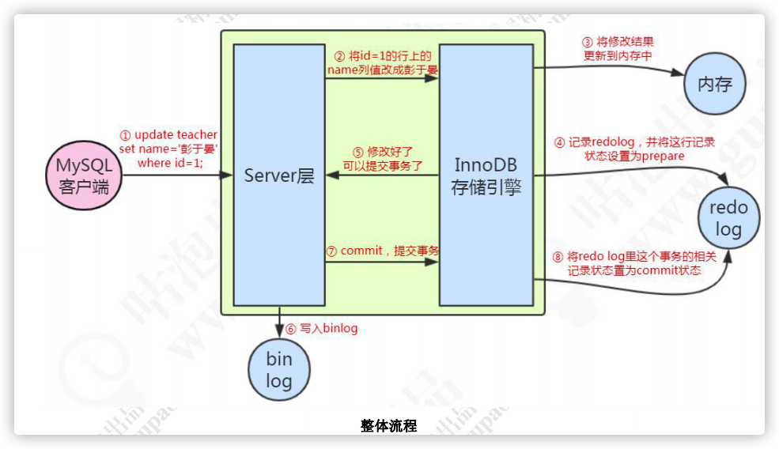

 [MySQL架构与SQL执行流程.pdf](source/MySQL架构与SQL执行流程.pdf) 

### 如何查询MySQL链接超时时间

```sql
show global variables like 'wait_timeout'; -- 非交互式超时时间，（JDBC程序）：2800s (8h)
show global variables like 'interactive_timeout'; -- 交互式超时时间，（数据库工具）：2800s (8h)
```

### 如何查看MySQL链接数量

```sql
show global status like 'Thread%';
```

| 链接类型 | 说明 |
| :--- | :--- |
| Threads\_catched | 缓存中的线程连接数 |
| Threads\_connected | 当前打开的连接数 |
| Threads\_created | 处理链接创建的线程数 |
| Threads\_running | 非睡眠状态的连接数，通常指并发连接数 |

### 查看链接的执行状态

```sql
show processlist;
```

> 具体参数信息详见[官网说明](https://dev.mysql.com/doc/refman/5.7/en/show-processlist.html)

| 链接状态 | 说明 |
| :--- | :--- |
| Sleep | 线程正在等待客户端，以向它发送一个新语句 |
| Query | 线程正在执行查询或往客户端发送数据 |
| Locked | 该查询被其他查询锁定 |
| Copying to tmp table on disk | 临时结果集合大于《》tmp\_table\_size。线程把临时表从存储器内部各式改变为磁盘模式，以节约存储器 |
| Sending data | 线程正在为SELECT语句处理行， 同事正在向客户端发送数据 |
| Sorting for group | 线程正在进行分类， 以满足GROUP BY要求 |
| Sorting for order | 线程正在进行分类，以满足ORDER BY要求 |

> 更多状态才考[官网说明](https://dev.mysql.com/doc/refman/5.7/en/thread-commands.html)

### MySQL最大连接数是多少

```sql
show variables like 'max_connections'; --在5.7版本中默认151个， 最大可设置为16384（2^14）
```

> show 的参数说明：
>
> * 默认级别为Session，全局使用 global级别
> * 动态修改， set 的内容重启后失效， 永久改动修改配置文件  /etc/my.cnf

### MySQL通信协议有哪些

* Unix Socket: 如linux服务器上没有指定-h参数， 则默认使用Socket方式连接
* TCP/IP： 如果添加了-h参数则使用了此种协议连接，这是默认协议， 也是使用最多的协议
* Named Pipes 与 Share Memory 两种协议只使用在Windows环境。

### MySQL使用的通信方式

| 通信方式 | 说明 |
| :--- | :--- |
| 单工 | 数据单向传输 |
| 半双工 | 数据双向传输，但不能同时传输 （MySQL使用的通信方式） |
| 全双工 | 数据双向传输，可以同时传输 |

> 半双工给MySQL带来的问题
>
> * mysql的查询语句不可以过长， 默认4M, 可以对max\_allowed\_\_packet参数进行设置
> * 返回大小受限制，所以sql中尽量避免不含limit的查询。进行分批查询。

### MySQL是否有缓存模块

mysql有自己的缓存模块， 但默认是关闭的。原因如下

* 它要求SQL语句必须一模一样，一个空格也不行
* 表里面任何一条数据发生变化，缓存失效

> mysql的缓存模块在8.0 版本被移除，推荐使用第三方ORM框架， 如：Mybatis；或独立的缓存服务，如：Redis

### MySQL的解析器（Parser）和预处理模块（Preprocessor）做了哪些工作

1. 词法解析：把一个完整的SQL解析成一个个单词，确定数据长度，类型。位置等信息
2. 语法解析：根据SQL语法做解析最终生成**解析树**，如引号括号是否闭合。
3. 预处理：检查**表名或者字段是否存在， **

### 查询优化器（Query Optimizer）与查询执行计划

查询优化器的目的就是根据解析树生成不同的执行计划（Execution Plan），然后选择最优执行计划

> MySQL里面使用的是基于开销（cost）的优化器。具体信息参考[官网说明](https://dev.mysql.com/doc/refman/5.7/en/server-status-variables.html)

```sql
show status like 'Last_query_cost';
```

### 优化器做了什么

简单举例说明：

1. 多张表关联时， 以那张表作为基准表。
2. 多个索引可以使用的时候， 使用哪个索引。

### 优化器如何得到执行计划

1. 打开优化器追踪（默认关闭状态，消耗性能）
2. 执行SQL后查看分析过程
3. 使用完后关闭追踪

```sql
--打开优化器追踪
show variables like 'optimizer_trace';
set optimizer_trace = 'enabled=on'; -- 注意设置的session 与 global级别； 默认session

--查看分析过程
select * from information_schema.optimizer_trace;

--关闭优化器分析过程追踪
set optimizer_trace = 'enabled=off';
show variables like 'optimizer_trace';
```

查询到的结果是json格式：主要分三个阶段：

* SQL准备阶段（join\_preparation）
* SQL优化阶段（join\_optimization）
* SQL执行阶段（join\_execution）

其中 expanded\_query:是最后执行的SQL语句； considered\_execution\_plan:列出了所有的执行计划。

### 如何查看MySQL的执行计划

```sql
explain select * from table; -- 在要执行的SQL前添加 explain 关键字
```

可以查询到多张表关联首先查询哪张表，可能用到哪些索引， 实际用到哪些索引。

> 需要注意：explain 的结果也不一定是最终的执行方式。

### 如何查看MySQL的存储引擎

```sql
show table status from 'gupao';
```

一个数据库可以使用多个存储引擎。

### 如何查看数据库存放数据的路径

```sql
show variables like 'datadir';
```

### 数据库支持的存储引擎

```sql
show engines;
```

> 个存储引擎的特性，详见[官网说明](https://dev.mysql.com/doc/refman/5.7/en/storage-engines.html)

### MyISAM存储引擎的特点

拥有三个物理存储文件

* 支持表级别的锁（插入和更新会锁表）， 不支持事物
* 拥有较高的插入（insert）和查询（select）速度
* 存储了表的行数（count速度更快）
* 只使用于只读类的数据分析项目

> 如何快速插入100万行数据：先使用MyISAM存储引擎插入数据， 再修改存储引擎为InnoDB。

### InnoDB存储引擎的特点

拥有两个物理存储文件

* 支持事物，支持外键。因此数据的完整性，一致性更高
* 支持行级别的锁和表级别的锁。
* 支持读写并发，写不阻塞读（MVCC）。
* 特殊的索引存放方式，可以减少IO， 提升查询效率
* 适合：经常更新的表，存在并发读写或者有事物处理的业务系统。

### Memory存储引擎的特点

拥有一个存储文件

* 把数据存储在内存里面， 读写速度很快， 但是数据库重启或者崩溃， 数据会全部消失，只适合做临时表

### CSV存储引擎的特点

拥有三个文件

* 不允许有空行
* 不支持索引
* 格式通用，可以直接编辑
* 适合：在不同数据库之间导入导出

### 如何选择存储引擎

1. 如果对数据一致性要求比较高，需要事物支持，可以选择InnoDB.
2. 如果数据查询多更新少，对查询性能要求比较高， 可以选择MyISAM。
3. 如果需要一个用于查询的临时表， 可以选择Memory.
4. 如果都不能满足要求， 可以使用C语言自己开发一个存储引擎，详情参考[官网说明](https://dev.mysql.com/doc/internals/en/custom-engine.html)

### MySQL的执行引擎（Query Execution Engine）的作用

直接操作存储引擎， 执行优化器分析后的最优执行计划。

## MySQL体系结构总结

### MySQL模块详解

图：MySQL模块详解.png

| 模块名称 | 说明 |
| :--- | :--- |
| Connector | 用来支持各种语言和SQL的交互，比如PHP， Python, JDBC |
| Management Serveices & Utilities | 系统管理和控制工具，包括备份恢复，MySQL复制，集群等 |
| Connection Pool | 连接池，管理需要缓存的资源，包括用户密码权限线程等 |
| SQL Interface | 用来接收用户的SQL命令，返回用户需要的查询结果 |
| Parser | 用来解析SQL语句 |
| Optimizer | 查询优化器 |
| Cache and Buffer | 查询缓存，除了行记录的缓存外，还有表缓存，key缓存，权限缓存等 |
| Pluggable Storage Engines | 插件存储引擎， 它提供API给服务层使用 |

### MySQL 架构分层

图：mysql架构分层.png

### 简要介绍InnoDB存储引擎的Buffer Pool

Buffer Pool是InnoDB存储引擎的一种缓冲池技术，也就是将磁盘读取到的页放在一块内存区域里面。这个内存区域叫做Buffer Pool,

buffer pool缓存的页面信息包括数据页。索引页。

### InnoDB内存结构和磁盘结构

图：InnoDB的内存结构与磁盘结构.png

内存中包含：Buffer Pool, Change Buffer、Adaptive Hash Index、还有一个（redo）log buffer

### 查看BufferPool状态

查看服务器状态，里面有很多跟BufferPool相关的信息

```sql
show status like '%innodb_buffer_pool%';
```

> 状态信息具体详见[官网说明](https://dev.mysql.com/doc/refman/5.7/en/server-status-variables.html)

### 修改Buffer Pool的参数

```sql
show variables like '%innodb_buffer_pool%';
```

> 参数信息具体详见[官网说明](https://dev.mysql.com/doc/refman/5.7/en/server-system-variables.html)

### 简介InnoDB存储引擎的Change Buffer功能

如果修改的数据不是唯一索引， 不需要加载磁盘索引页检查唯一性， 那这种情况下是可以将修改记录在缓冲池中的，这个区域就是Change Buffer。再由Change Buffer 记录到数据也的操作叫做merge 在一下情况下会触发merge操作：

* 访问这个数据也的时候
* 通过后台线程，或者数据库shutDown
* redo log写满时

优化：如果数据库大部分索引都是非唯一索引。并且业务是写多杜少， 不会再写数据后立刻读取，就可以使用ChangeBuffer（写缓冲）。写多读少的业务。调大这个值。

```sql
show variables like 'innodb_change_buffer_max_size'; --代表ChangeBuffer占bufferPool的比例，默认25%
```

### Adaptive Hash Index \(后续完善\)

### （redo）Log Buffer

为了避免数据库宕机造成的数据丢失，InnoDB把对页面的修改操作专门写入一个日志文件， 并且数据库启动时从这个文件进行恢复操作（实现crash-safe）用它来实现事物的持久性。这个文件叫做redo log。对应/var/li8b/mysql/ib\_logfile0\|ib\_logfile1每个48M.

MySQL的WAL\(Write-Ahead Logging\)技术，关键点就是先写日志， 再写磁盘。日志与磁盘配合进行的一个过程。

关于log buffer的参数设置

```sql
show variables like 'innodb_log%';
```

| 值 | 说明 |
| :--- | :--- |
| innodb\_log\_file\_size | 指定每个文件的大小，默认48M |
| innodb\_log\_files\_in\_group | 指定文件的数量，默认2 |
| innodb\_log\_group\_home\_dir | 指定文件所在的路径，相对或绝对，默认datadir |

redo log不是每次都写入磁盘， 在BufferPool里面有一个内存区域（logBuffer）专门用来保存即将要写入日志文件的数据， 默认16M.

```sql
show variables like 'innodb_log_buffer_size';
```

redo log的内容主要用于崩溃恢复。我们写入到磁盘的时候， 操作系统本身是有缓存的， flush就是吧操作系统缓冲区写入到磁盘。

log buffer写入磁盘的时机，由一个参数控制，默认是1

```sql
show variables like 'innodb_flush_log_at_trx_commit';
```

> 详细介绍参见[官网说明](https://dev.mysql.com/doc/refman/5.7/en/innodb-parameters.html)

| 值 | 说明 |
| :--- | :--- |
| 0（延迟写） | logbuffer将每秒写入logfile中，并且logfile的flush操作同事进行。该模式下， 在事务提交的时候，不会主动触发写入磁盘的操作。 |
| 1（默认，实时写， 实时刷） | 每次事物提交的时候MySQL回吧logbuffer的数据写入logfile，并且刷到磁盘中去 |
| 2（实时写， 延迟刷） | 每次提交的时候MySQL会把logbuffer的数据写入logfile.但是flush操作不会同事进行。该模式下，MySQL会每秒执行一次 flush |

### Redo log 有什么特点

* redo log 是InnoDB存储引擎实现的， 并不是所有的存储引擎都有
* 不是记录数据更新之后状态， 而是记录这个也做了什么改动， 属于**物理日志**
* redolog的大小是固定的， 前面的内容会被覆盖

### InnoDB的磁盘结构

五大表空间：

1. 系统表空间\(system tablespace\)：默认的共享表空间（/var/lib/mysql/ibdata1）:包含：InnoDB数据字典和双写缓冲区，ChangeBuffer. undo Logs,如果没有指定file-per-table，也包含用户创建的表和索引数据。
   1. undo后面介绍，因为有独立的表空间。
   2. 数据字典：有内部系统表组成，存储表和索引的元数据（定义信息）
   3. 双写缓冲（InnoDB的一大特性）
      1. InnoDB的页和操作系统的页大小不一致， InnoDB页大小为16k， 操作系统的页大小为4k, InnoDB写入磁盘时，一个页需要分四次写。如果存储引擎正在写入也的数据到磁盘时发生了宕机， 可能出现页只写入一部分的情况。所以在对于应用redolog之前，需要一个**页的副本**。如果出现了写入失效，就用也的副本来还原这个页。然后在应用redolog，这个页的副本就是double write， InnoDB的双写技术。通过它实现了数据页的可靠性。
2. 独占表空间（file-per-table tablespace）：我们可以让每一张表独占一个表空间。默认开启
3. 通用表空间（generaltablespaces）
4. 临时表空间（temporary tablespace）
5. undo log tablespace

### InnoDB后台进程

1. master thread
2. IO thread
3. purge thread
4. page cleaner thread

### Binlog

binglog以事件的形式记录了所有的DDL和DML语句（因为他记录的是操作不是数值， 属于**逻辑日志**）不同于Redolog， 他的文件内容是可以追加的， 没有固定大小限制。可以做**数据恢复**，也可以用来实现**主从复制**，原理就是从主服务器读取binlog然后执行一遍。

### 一条更新SQL的整体执行流程

1. 先查询数据， 如果有缓存则用到缓存
2. 做相应的修改操作，调用引擎API接口，写入这一行数据到内存，同时记录redolog。这时redolog进入prepare状态，然后告诉执行器执行完成了，可以提交
3. 执行器收到通知后，记录binlog，然后调用存储引擎接口， 设置redolog为commit状态
4. 更新完成



