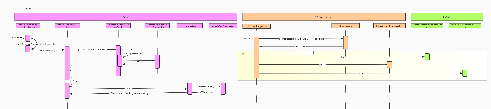

### SpringAOP

> 参考文档 [【课堂笔记】一步一步手绘Spring AOP运行时序图.pdf](SpringAOP.assets/[课堂笔记]一步一步手绘Spring AOP运行时序图.pdf) 

* Aspect: 表示切面。切入业务流程的一个独立模块。一个应用程序可以拥有任意数量的切面。
* Join Point: 表示连接点。也就是业务流程在运行过程中需要插入切面的具体位置。
* Advice: 表示通知。是切面的具体实现方法。可分 为前置通知（Before）、后置通知（AfterReturning）、异常通知（AfterThrowing）、最终通知（After）和环绕通知（Around）五种。实现方法具体属于哪类通知，是在配置文件和注解中指定的。例如，VerifyUser类的beforeAdvice方法就是前置通知。
* Pointcut: 表示切入点。用于定义通知应该切入到哪些连接点上，不同的通知通常需要切入到不同的连接点上。例如，前面案例配置文件的<aop:pointcut>标签。
* Proxy: 表示代理对象。将通知应用到目标对象之后被动态创建的对象。可以简单地理解为，代理对象为目标对象的业务逻辑功能加上被切入的切面所形成的对象。
* weaving: 表示切入，也称为织入。将切面应用到目标对象从而创建一个新的代理对象的过程。这个过程可以发生在编译期、类装载期及运行期。