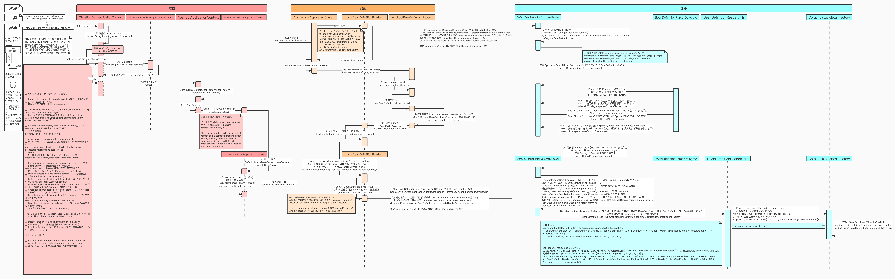

### SpringIOC

> 参考文档 [【课堂笔记】一步一步手绘Spring IOC运行时序图.pdf](SpringIOC.assets/[课堂笔记]一步一步手绘Spring IOC运行时序图.pdf) 

### SpringIOC时序图

SpringIOC的装载方式

* xml配置bean
* @Configuration 注解的配置类内声明@Bean的方法返回Bean
* Enable... 方式配置模块化加载方式加载不同的Bean
* SpringFactoryLoader(SPI)动态装载Bean