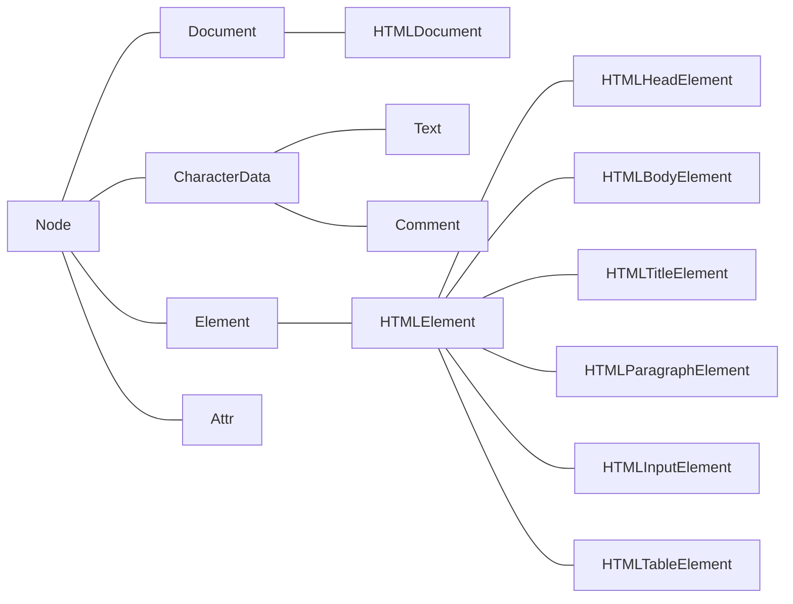

### 什么是DOM（Document Object Model）

DOM 定义了表示和修改文档所需的方法， DOM对象即为宿主对象，由浏览器厂商定义，用来操作html和xml功能的一类对象的集合，也有人称DOM是对HTML以及XML的标准编程接口。

### DOM基础操作

> document代表整个文档

* document.getElementById(); 元素id在IE8一下的浏览器， 不区分ID与Name
* .getElementsByName(); // 标签名
* getElementsByClassName(); // 类名，IE8及一下版本中没有
* querySelector(); // css选择器， 在IE7及一下版本中没有
* querySelectorAll(); // css选择器， 在IE7及一下版本中没有

### 节点类型

* 元素节点（1）
* 属性节点（2）
* 文本节点（3）
* 注释节点（8）
* document（9）
* DocumentFragment （11）

### 元素的基本操作

基于节点的遍历：

* firstChild --- 第一个节点
* lastChild  --- 最后一个节点
* nextSibling --- 最后一个兄弟节点
* previousSibling --- 前一个兄弟节点
* hasChildNodes() --- 当前节点是否拥有子节点

基于元素节点的遍历

* parentElement --- 当前元素的父元素节点（IE不兼容）
* children --- 当前元素节点的元素子节点
* node.childElementCount = node.children.length
* firstElementChild --- 返回第一个元素节点（IE不兼容）
* lastElementChild --- 返回最后一个元素节点（IE不兼容）
* nextElementSibling -- 返回后一个兄弟节点
* previousElementSibline --- 返回前一个兄弟节点

### 节点的四个属性

* nodeName: 元素的标签名， 以答谢形式表示， 只读
* nodeValue: Text节点或Comment节点的文本内容， 可读写
* nodeType: 该节点的类型， 只读
* attributes: Element 节点的属性集合

### DOM结构树



### DOM基本操作

1. getElementById方法定义在Document.prototype上，即Element节点上不能使用。

2. getElementsByName方法定义在HTMLDocument.prototype上，即非html中的document不能使用（xml document， element）。

3. getElementsByTagName方法定义在Document.prototype和Element.prototype上

4. HTMLDocument.prototype定义了一些常用的属性，body, head分别指代HTML文档中的<body>, <head> 标签.

5. Document.prototype上定义了documentElement属性， 指代文档中的根元素，在HTML文档中， 他总是指代<html>元素

6. getElementsByClassName, querySelectorAll, querySelector在Document.prototype, Element.prototype类中均有定义。

7. 增加内容：

   1. document.createElement();
   2. document.createTextNode();
   3. document.createComment();
   4. document.createDocumentFragment();

8. 插入内容

   1. PARENTNODE.appendChild();
   2. PARENTNODE.insertBefor(a, b);

9. 删除内容

   1. parent.removeChild();
   2. child.remove();

10. 替换内容

    1. parent.replaceChild(new, origin);

11. 元素（Element）节点的一些属性

    1. innerHTML
    2. innerText（火狐不兼容）/textContent（老版本IE不好使）

12. 元素（Element）节点的一些方法

    1. ele.setAttribute()
    2. ele.getAttribute()

13. 查看滚动条的滚动距离

    1. window.pageXOffset/pageYOffset

       > IE8及一下版本不兼容

    2. document.body/documentElement.scrollLeft/scrollTop

       > 兼容性比较混乱，同时取两个值相加， 因为不可能存在两个同时有值的情况
       >
       > IE8和IE8以下浏览器对这两个方法存在不确定兼容， 但至少一个是有值的， 另外一个肯定是0.

    3. 封装兼容性方法， 求滚动轮滚动距离getScrollOffset（）

       ```javascript
       function getScrollOffset() {
         if (window.pageXOffset) {
           return {
             x: window.pageXOffset,
             y: window.pageYOffset
           }
         } else {
           return {
             x: document.body.scrollLeft + document.documentElement.scrollLeft,
             y: document.body.scrollTop + document.documentElement.scrollTop
           }
         }
       }
       ```

14. 查看视图的尺寸

    1. window.innerWidth/innerHeight

       > IE8及以下不兼容

    2. document.documentElement.clientWidth/clientHeight

       > 标准模式下，任意浏览器都兼容

    3. document.body.clientWidth/clientHeight

       > 适用于怪异模式下的浏览器

    4. 封装兼容性方法， 返回浏览器尺寸getViewportOffset()

       ```javascript
       function getViewportOffset() {
         if (window.innerWidth) {
           return {
             w: window.innerWidth,
             h: window.innerHeight
           }
         } else {
           if(document.compatMode === 'BackCompat') {
             return {
               w: document.body.clientWidth,
               h: document.body.clientHeight
             }
           } else {
             return {
               w: document.documentElement.clientWidth,
               h: document.documentElement.clientHeight
             }
           }
         }
       }
       ```

15. 查看元素的几何尺寸

    1. document.getBoundingClientRect();

       > * 兼容性好
       > *  该方法返回一个对象，对象里面有left, top, right, bottom,等属性。 left和top，代表的是元素左上角的xy坐标，right和bottom代表的是元素右下角的xy坐标。
       > * height 和 width属性老版本IE并未实现
       > * 返回结果并不是实时的

16. 查看元素的尺寸

    1. dom.offsetWidth, dom.offsetHeight

17. 查看元素的位置

    1. dom.offsetLeft, dom.offsetTop

       > 对于无定位父级元素， 返回相对文档的坐标， 对于有定位父级元素， 返回相对于最近的定位的父级的坐标

    2. dom.offsetParent

       > 返回最近的有定位的父级， 如无，返回body， body.offsetParent返回null

18. 让滚动条滚动

    1. window上的三个方法： scroll(), scrollTo(), scrollBy();

       > 三个方法功能类似， 都是将xy坐标传入， 即实现让滚动轮滚动到当前位置。
       >
       > 区别：scrollBy()会在之前的数据基础上做累加


