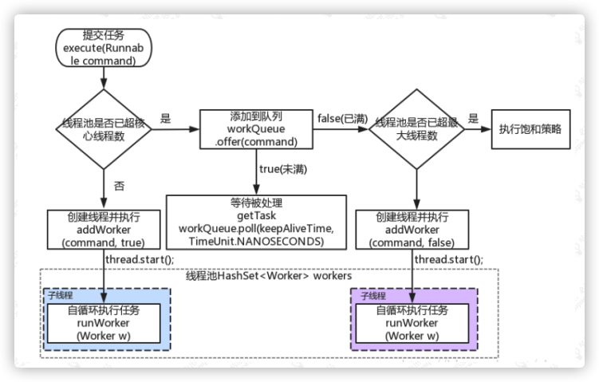
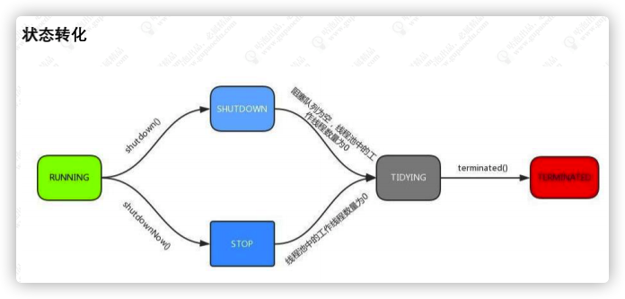

参考 [线程池的实现原理分析.pdf](source/线程池的实现原理分析.pdf) 

### 什么是线程池

为了解决创建线程过多, 使得系统由于过度消耗内存或切换过度导致的系统资源不足的问题, 设计出线程池的概念, 主要逻辑是提前创建好一定数量的线程, 需要使用时,直接使用创建好的线程执行响应逻辑, 使用完毕后不销毁, 而是等待后续的需求使用. 这样避免了重复创建线程带来的系统资源消耗.

### 线程池的优点

1. 降低创建线程和销毁线程的性能开销
2. 提高响应速度, 当有新任务需要执行时, 不需要等待线程创建就可以立马执行
3. 合理的设置线程池大小可以避免因为线程数超过硬件资源瓶颈带来的问题

### 线程池的使用

```java
Public Test implements Runable {
  public void run() {
    try {
      Thread.sleep(10);
    }catch (InterruptedException e) {
      e.printStackTrack();
    }
    System.out.println(Thread.currentThread().getName());
  }
  static ExecutorService service = Executors.newFixedThreadPool(3);
  
  public static void main(String[] args) {
    for (int i = 0; i < 100; i++) {
      service.execut(new Test());
    }
    service.shutdown();
  }
}
```

### Java提供的线程池的API

* newFixedThreadPool: 返回一个固定数量的线程池, 线程数量不变, 当一个任务提交时, 若线程池中空闲, 则立即执行, 若没有, 则会被暂存在一个任务队列中. 等待有空闲的线程执行
* newSingleThreadExecutor: 创建一个线程的线程池, 若空闲则执行,若没有空闲则暂存在任务队列中, 等待空闲线程执行
* newCachedThreadPool: 返回一个可以根据实际情况调整线程个数的线程池, 不限制最大线程数量, 若物控线的线程则执行任务, 若无任务则不创建线程, 并且每一个线程会在60s后自动回收
* newScheduledThreadPool: 创建一个可以指定线程数量的线程池, 但是这个线程还带有延迟和周期性执行任务的功能,, 类似定时器.

### ThreadPoolExecutor有哪些构造参数

```java
public ThreadPoolExecutor (
	int corePoolSize, 					// 核心线程数量 
  int maximumPoolSize,				// 最大线程数量
  long keepAliveTime,					// 超出核心线程数量意外的线程空余存留时间
  TimeUnit unit,							// 存活时间单位
  BlockingQueue<Runnable> workQueue,	// 保存执行任务的队列
  ThreadFactory threadFactory,// 创建新线程使用的工厂
  RejectedExecutionHandler handler		// 当前任务无法执行的时候的处理逻辑
);
```

### 线程池初始化后做了什么

线程池初始化时是没有创建线程的, 线程池里面的线程的初始化与其他线程一样, 但是在完成任务后, 不会自行销毁, 而是以挂起的状态返回到线程池. 直到应用程序再次向线程池发出请求时, 线程池里面挂起的线程就会再度激活执行任务, 这样既节省了建立线程所造成的的性能损耗, 也可以让多个任务重复用同一个线程, 从而在应用程序生存期内节约大量开销

### 线程池的实现原理分析



1. 如果当前池中线程比核心数少, 新建一个线程执行任务
2. 如果池中已满, 但任务队列未满, 添加到队列中
    1. 任务成功添加到队列后, 再次检查是否需要添加新的线程, 因为已存在的线程可能被销毁了
        1. 如果线程池处于非运行状态, 并且吧当前的任务从任务列表中移除成功, 则拒绝该任务
        2. 如果之前的线程已被销毁完, 新建一个线程执行任务
3. 核心吃已满, 队列已满, 则尝试添加一个新的线程
    1. 如果尝试创建线程失败, 则说明线程池已关闭或者线程池完全满了, 拒绝任务

### 线程池的运行状态

> 运行状态保存在int值的高3位(所有数值左移29`Integer.SIZE - 3`位)

* RUNNING:  `-1 << 29`  接收新任务, 并执行队列中的任务

* SHUTDOWN: `0 << 29` 不接受新任务, 但执行队列中的任务

* STOP: `1 << 29` 不接受新任务, 不执行队列中的任务, 中断正在执行的任务.

* TIDYING: `2 << 29` 所有的任务都已结束, 线程数量为0, 处于该状态的线程池即将调用terminated()方法

* TERMINATED: `3 << 29` 执行完成

       

### 线程池核心类与方法

* Worker: addWorker()方法构建一个Worker对象, 一个Worker封装了第一个需要执行的任务, 与一个线程. 可以理解为一个Worker就是一个线程.

    Worker继承了AQS, 使用AQS实现独占锁的功能, 在tryAcquire()方法中不予许重入, 作用如下:

    1. 如果是独占状态(执行的任务), 不应该中断线程;
    2. 如果不是独占状态(空闲状态), 可以对线程执行中断
    3. 线程池在执行shutdown(), 或tryTerminate()方法会调用interruptIdleWorkers()方法中来中断空闲线程, 其中使用tryLock()方法来判断线程的空闲状态.

* addWorkerFailed: 如果执行addWorker()方法失败执行此方法

    1. 如果woker已经构造好了, 则移除woker
    2. 原子递减核心线程数(因为addWoker()中做了原子增加)
    3. 尝试结束线程池

* runWorker(): 真正的Worker执行逻辑:

    1. 如果task不为空, 则开始执行task
    2. 如果task为空, 则通过getTask()方法获取新的任务, 如果获取到的Runnaable不为空, 则执行该任务
    3. 执行完毕后, 通过while循环继续getTask()取任务
    4. 如果getTask() 取到的任务依然时空, 那么整个runWorker方法执行结束

* getTask(): 此方法不是简单的获取任务, 而是实现了线程销毁倒计时的功能

    在线程从队列中poll任务的时候加上了超时时间, 如果在keepAliveTime的时间内poll不到任务, 那么我们就认为这条线成没事做, 可以删除.

* processWorkerExit(): 在runWorker的while循环执行完毕后, 在finally中调用此方法, 销毁工作线程

### 线程池满后拒绝任务的策略分类

1. AbortPolicy: 直接抛出异常, 默认策略
2. CallerRunsPolicy: 用调用者所在的线程来执行任务
3. DiscardOldestPolicy: 丢弃阻塞队列中靠前的任务, 并执行当前任务
4. DiscardPolicy: 直接丢弃任务
5. 根据应用场景实现RejectedExecutionHandler接口, 自定义饱和策略, 如记录日期或持久化存储不能处理的任务

### 如何合理的配置线程池的大小

> 首先需要根据具体的业务来判断任务执行属于cpu密集型还是IO密集型

* cpu密集型: CPU核心数=最大同时执行线程数; 最大线程数cpu+1, 过多的线程会导致上下文切换过于频繁, 降低cpu使用率
* IO密集型: 包括文件系统的IO, 网络IO, 系统资源访问.线程池设定最佳线程数=((线程池设定的线程等待时间 + 线程CPU时间) / 线程CPU时间) * cpu数量

### 线程池中线程的初始化问题

线程池在初始化后, 线程池中是没有线程的, 当提交任务需要线程执行的时候才会去创建一个线程, 如果像要提前创建线程可以调用下面的方法实现

* ThreadPoolExecutor.prestartCoreThread() : 初始化一个核心线程
* ThreadPoolExecutor.prestartAllCoreThreads(): 初始化所有的核心线程

### 线程池的关闭

线程池提供了两种关闭的方法:

* shutdown(): 不会立即终止线程池, 而是要等所有任务缓存队列中的任务都执行完终止.不会接受新的任务
* shudownNow(): 立即终止线程池, 并尝试打断正在执行的任务, 并且清空缓存队列, 返回尚未执行的任务.

### 线程池容量的动态调整

ThreadPoolExecutor提供了动态调整线程池容量大小的方法:

* setCorePoolSize(): 设置核心线程池大小
* setMaximumPoolSize(): 设置线程池最大数量

> 任务缓存队列及排队策略
>
> * ArrayBlockingQueue: 基于数组的先进先出队列, 次队列要求创建时必须制定大小
> * LinkedBlockingQueue: 基于链表的先进先出队列, 如果创建时没有制定队列的大小, 则默认使用此队列, 默认长度: Integer.MAX_VALUE.
> * SynchronousQueue: 这个队列比较特殊, 它不会保存提交的任务, 而是将直接新建一个线程来执行新来的任务.

### 线程池的监控

我们可以重写beforeExecute, afterExecute, shutdown()等方法, 来实现对线程池中线程的监控

### 线程池中submit, 与execute两个方法的区别

* execute: 只可以接受一个Runnable的参数, 如果出现异常则抛出, 没有返回值
* submit: 可以接收Runnable和Callable两种类型的参数, 如果传入的是一个Callable, 可以接收到一个Future的返回值, 有异常不会抛出, 除非调用Future.get

> AbstractExecutorService.submit() 只是对传入的Callable对象进行了一层RunnableFuture的封装, 然后执行execute(RunnableFuture<T>);

