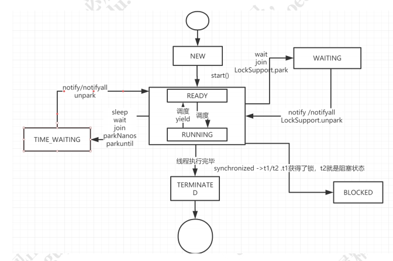

参考文档:  [【笔记】并发编程第一节课-并发编程的基本认识 .pdf](source/[笔记]并发编程第一节课-并发编程的基本认识 .pdf)  [线程基础回顾.pdf](source/线程基础回顾.pdf) 

### 实现多线程的方式

> 继承Thread类，实现Runnable接口，使用ExecutorService，Callable，Future实现带有结果返回的多线程

* 继承Thread类创建线程

```java
public class MyThread extends Thread {
    public void run() {
        System.out.println("MyThread.run()");
    }
}

MyThread t1 = new MyThread();
MyThread t2 = new MyThread();
t1.start();
t2.start();
```

* 实现Runnable接口创建线程
* > 如果自己的类已经继承另外一个类， 就无法直接继承Thread类。

```java
public class MyThrea extends OtherClass implements Runnable {
    public void run() {
        System.out.println("MyThread.run()");
    }
}
```

* 实现Callable接口通过FutureTask包装器来创建Thread线程

```java
public class CallableDemo implements Callable<String> {
    public static void main(String[] args) throws ExecutionException, InterruptedException {
        ExecutorService executorService = Executors.newFixedThreadPool(1);
        CallableDemo callableDemo = new CallableDemo();
        Future<String> future = executeorService.submit(callableDemo);
        System.out.println(future.get());
        executeorService.shutdown();
    }
    @Override
    public String call() throws Exception {
        int a = 1;
        int b = 2;
        System.out.println(a + b);
        return "执行结果：" + (a + b); 
    }
}
```

### 线程的生命周期

> 一个线程6种状态： new, runnable, blocked, waiting, time\_waiting, terminated

* NEW：初始状态， 线程被构建，但还没调用start方法
* RUNNABLE：运行状态， JAVA线程中表操作系统中的就绪和运行两种状态统称为“运行中“
* BLOCKED：阻塞状态，线程进入等待状态， 放弃CPU使用权
  * 等待阻塞：运行线程执行wait方法，JVM会把当前线程放入到等待队列。
  * 同步阻塞：运行的线程在获取对象的同步锁时，若该同步锁已被其他线程锁占用了， 那么JVM会把当前线程放入到锁池中
  * 其他阻塞：运行的线程执行Thread.sleep或者t.join方法， 或者发出了I/O请求时，JVM会把当前线程设置为阻塞状态， 当sleep结束，join线程终止，io处理完毕则线程恢复
* TIME\_WAITING：超时等待状态，超时以后自动返回
* TERMINATED：终止状态， 表示当前线程执行完毕



### 线程的调试

* jps 命令可以查看Java进程pid
* jstack pid 是Java虚拟机自带的一种堆栈跟踪工具

### 线程启动原理

线程启动调用线程的start方法, 使线程进入rannable状态, 具体调用时间则由cpu统一调度

start方法,调用一个native方法start0()来启动一个线程. start0()这个方法是在Thread的静态块中注册的.

### 线程的终止

线程的终止不建议调用stop方法. 而是通过interrupt方法

其他线程调用本线程的interrupt方法, 通知本线程可以终止, 具体终止操作, 由本线程自己控制, 可以通过isInterrupted()方法来获取中断信息.这样做可以让线程有机会做一些清理操作等后事.

* 其他线程调用当前线程的interrupt()方法: 表示告知当前线程可以终止
* 当前线程调用isInterrupted()方法: 获取当前线程是否被通知停止
* Thread.interrupted()方法: 将执行线程的状态改回到未中断状态

### 线程的复位

Thread.interrupted方法可以将其他线程设置的中断信号量复位, 提供复位功能是为了使其他线程知道当前线程已经收到中断信息, 只是当前线程现在不想中断的一种交流, 就提中断时间还是有当前线程控制.

?? thread.interrupt()方法实际就是设置一个interrupted状态标识为true,并通过ParkEvent的unpark方法来唤醒线程.

1. 对于synchronized阻塞的线程, 被唤醒以后会继续尝试获取锁, 如果失败仍然可能被park
2. 在调用ParkEvent的park方法之前, 会先判断线程中断状态, 如果为true, 会清除当前线程的中断标识
3. Object.wait, Thread.sleep, Thread.join会抛出InterruptedException

### 发生死锁的条件


### 并发编程的三个概念

* 原子性
* 可见性
* 有序性

