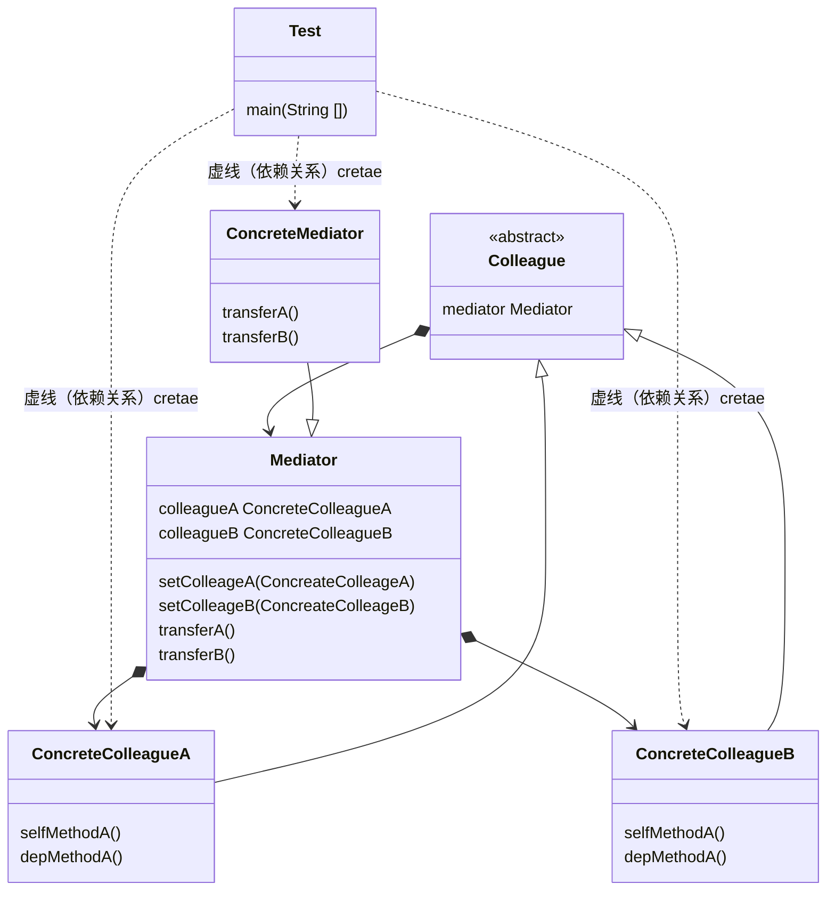

### 中介者模式（Mediator Pattern）

又称为调解者模式， 或者调停者模式，用一个中介对象封装一系列的对象交互，中介者使各对象不需要显示的相互作用，从而使其耦合松散，而且可以独立的改变它们之间的交互。属于行为型模式。

> 优点：
>
> 1. 减少类依赖将对多依赖转化为一对多，降低类耦合；
> 2. 类各司其职， 符合迪米特法则
>
> 缺点：
>
> 1. 同事越多， 中间者会约臃肿

### 角色与UML

* 抽象中介者（Mediator）:定义统一的接口，用于个同事角色之间的通信
* 具体中介者（ConcreteMediator）：从具体的同事对象接受消息，向具体的同事对象发送消息，协调个同事之间的协作。
* 抽象同事类（Colleague）: 每一个同事对象均需要依赖中介者角色，与其他同事间通信时，交由中介者进行转发协作；
* 具体同事类（ConcreteColleague）: 负责实现自发行为（Self-Method），转发依赖方法（Dep-Method）交由中介者协调。

### 源码中的中介者

* JDK的Timer的schedule()方法

