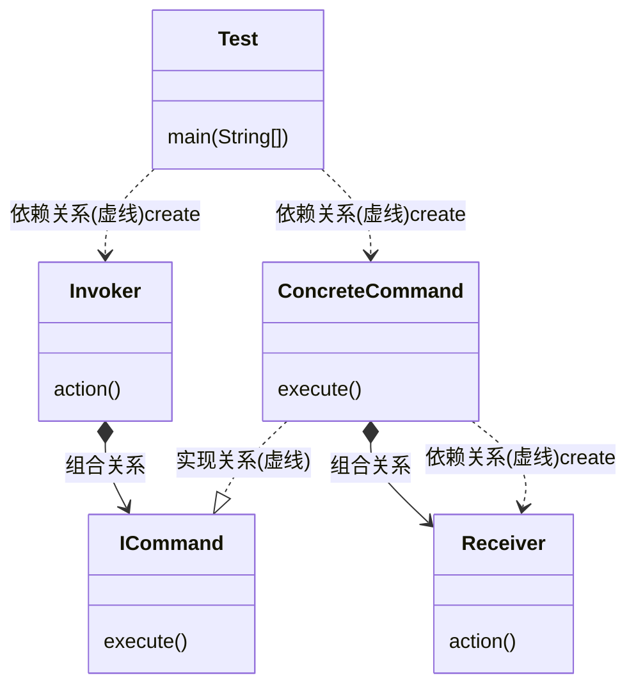

命令模式(Command Pattern)

对命令的封装, 每一个命令就是一个操作,发送请求, 由接收方执行, 命令模式解耦了请求方与接收方.属于行为型模式.

> 优点:
>
> 1. 通过引入中间件(抽象接口), 解耦了命令请求与实现
> 2. 扩展性良好, 可以很容易的新增新命令
> 3. 支持组合命令, 支持命令队列;
> 4. 可以在现有命令上扩展如日志功能.
>
> 缺点:
>
> 1. 具体命令可能过多
> 2. 引入额外的类实现解耦请求与实现, 增加代码复杂度.

角色与UML

* 接收者角色(Receiver):该类负责具体实施与执行一个请求
* 命令角色(Command): 定义需要执行的所有命令
* 具体命令角色(ConcreteCommand):该类内部维护一个接受者(Receiver),在其execute方法中调用Receiver的相关方法.
* 请求者角色(Invoker): 接收客户端的命令, 并执行命令

### 源码中的命令模式

* JDK中的Runnable接口.
* junit.framework.Test接口.

