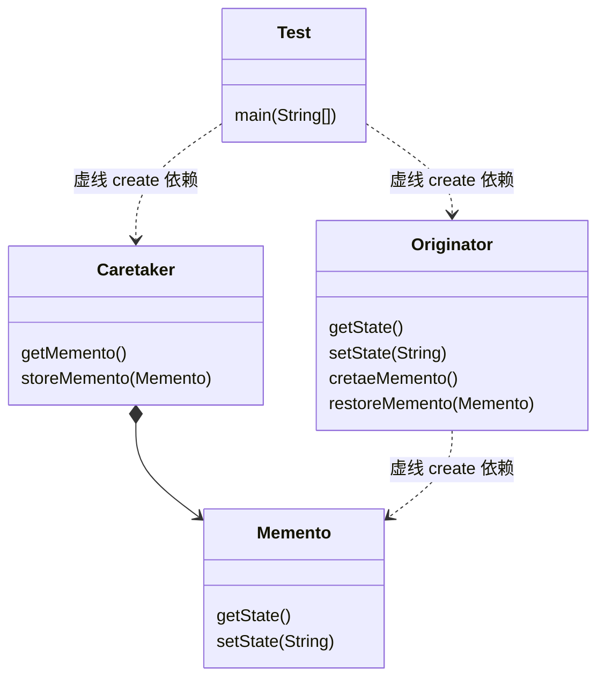

### 备忘录模式（Memento Pattern）

又称快照模式（snapshot Pattern）或令牌模式（Token Pattern），是指不破坏封装的前提下，捕获一个对象的内部状态，并在对象之外保存这个状态，这样以后就可将该对象恢复到原先保存的状态，属于行为型模式。

> 本质是从发起人实类（Originator）隔离存储功能，降低实体类的职责，同时由于存储信息（Memento）独立，且存储信息的实体交由管理类（Caretaker）管理，则可以通过为管理类扩展额外的功能。
>
> 优点：
>
> 1. 简化发起人实体类职责，隔离状态与获取。实现信息封装，客户端无需关系状态的保存细节
> 2. 提供状态回滚功能
>
> 缺点：
>
> 1. 消耗资源。

### 角色与UML

* 发起人角色（Originator）：负责创建一个备忘录，记录自身需要保存的状态；具备状态回滚功能；
* 备忘录角色（Memento）：用于存储Originator的内部状态，且可以防止Originator以外的对象访问。
* 备忘录管理员角色（Caretaker）： 负责存储， 提供管理备忘录（Memento）， 无法对备忘录内容进行操作和访问。

