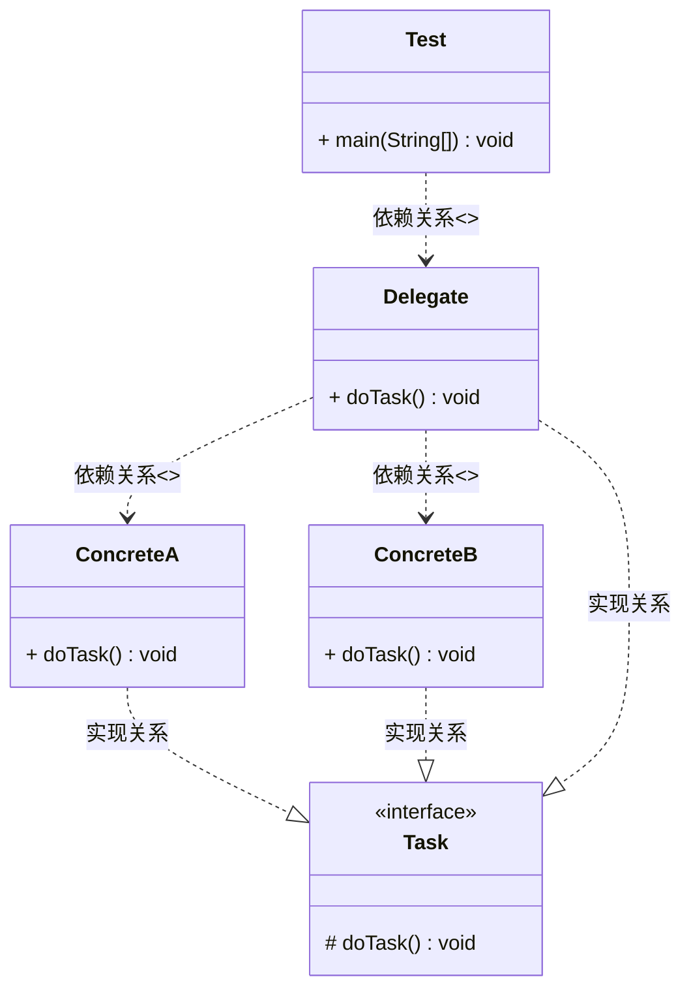

### 委派模式（Delegate Pattern）

> 参考文档： [委派模式与模板方法模式详解.pdf](source/委派模式与模板方法模式详解.pdf) 

又称委托模式， 一种面向对象的设计模式， 允许对象组合实现对继承相同的代码重用。他基本就是负责任务的调用和分配任务， 是一种特殊的静态代理，可以理解为全权代理。但是代理模式注重过程， 而委派模式注重结果，属于行为模式，不属于GOF23种设计模式。

> 优点：细化任务，提高管理任务状态的效率
>
> 缺点：增加系统复杂度， 针对复杂任务的多重委派会更复杂

### 委派模式的角色及类图

* 抽象任务角色（Task）：定义一个抽象接口， 它有若干实现类。
* 委派者角色（Delegate）：负责在哥哥具体角色实例之间做出决策，并判断调用具体实现方法。
* 具体任务角色（Concrete）： 真正执行任务的角色。

### 生活中的委派

Boss下达命令给Leader, Leader根据不同的任务分配给不同的员工。

### 源码中的委派

* JVM 中的类加载使用的是双亲委派模型
* SpringMVC中的DispatcherServlet
* SpringIOC中的doRegisterBeanDefinitions()方法

