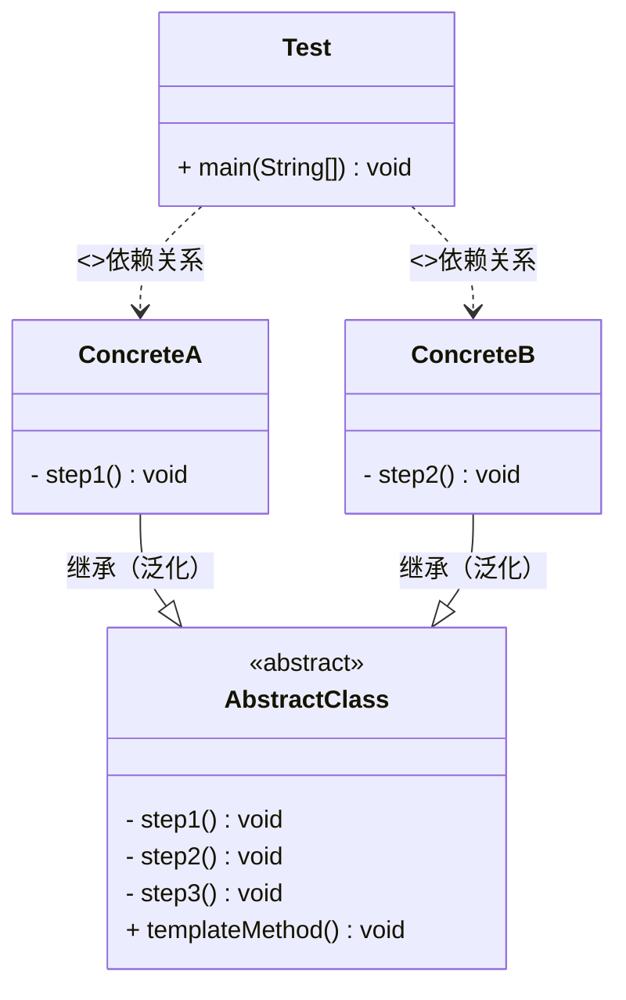

### 模板方法模式（Template Metond Pattern）

定义一个操作中的算法的框架， 而将一些步骤延迟到子类中， 是的子类可以不改变算法的结构即可定义改算法的默写特定步骤， 属于行为型设计模式。其本质是<kbd>抽象封装流程，具体进行实现</kbd>

> 优点：
>
> 1. 利用模板方法将相同处理逻辑的代码放在抽象父类中， 可以提高代码的复用性
>
> 2. 将不同的代码放在不同的子类中， 通过子类的扩展增加新的行为， 提高代码的扩展性。
> 3. 不变的行为写在父类上， 去除子类的重复代码， 提供了一个很好的代码复用平台， 符合开闭原则
>
> 缺点：
>
> 1. 类数目的增加， 每一个抽象类都需要一个子类来实现，导致类数量的增加，增加系统复杂性
> 2. 抽象关系自身缺点， 如果父类添加新的抽象方法， 所有的子类都要改一遍

### 生活中的模板方法模式

把大象放进冰箱， 宋丹丹定义了具体的流程， 具体实现可以有具体的人再去想办法。

### 模板方法的角色及类图

* 抽象模板（AbstractClass）: 抽象模板类定义了一套算法的框架及流程
* 具体实现（ConcreteClass）: 具体实现类对算法框架/流程的默写步骤进行了实现

### 代码实现模板方法中的钩子方法

### 源码中的模板方法

* JDK的AbstractList的get()是一个抽象方法， 具体实现有具体的实现类实现
* MyBatis框架中的BaseExecutor,它是一个基础的车SQL执行类， 实现了大部分的SQL执行逻辑，然后把几个方法交给子类定制化完成。

