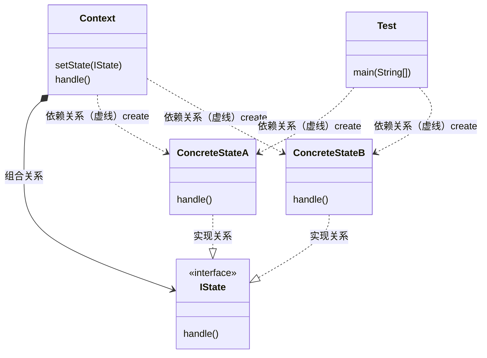

### 状态模式（State Pattern）

> 参考文档： [状态模式与备忘录模式详解.pdf](source/状态模式与备忘录模式详解.pdf) 

也称状态机模式（State Machine Pattern）,是允许对象在内部状态发生改变时改变它的行为，对象看起来好像修改了它的类， 属于行为型模式。

> 不同的状态， 对象拥有不同的行为
>
> 优点：
>
> 	1. 结构清晰，消除冗余if判断，代码简洁
>  	2. 将状态转换显示化，易于理解
>
> 缺点：
>
> 1. 类膨胀
> 2. 实现比较复杂，如果使用不得当，会使代码混乱
> 3. 不符合开闭原则， 添加状态需要修改转换器角色代码

### 生活中的状态模式

* 订单状态的变化
* 电梯状态的变化

### 角色与UML

* 环境类角色（Context）: 定义客户端需要的接口，内部维护一个当前状态实例， 并负责具体状态的切换。
* 抽象状态角色（State）: 定义该状态下的行为 ，可以有一个或多个行为。
* 具体状态角色（ConcreteState）: 具体实现该状态对应的行为， 并且在需要的情况下进行状态的切换。

### 与其他设计模式 的区别

* 状态模式与责任链模式

  状态模式着重状态， 该状态下的所有行为定义； 责任链注重责任，专注于某一件事， 两者都可以消除多if的情况

* 状态模式与策略模式

  从UML来看是一样的， 但策略模式注重多种策略选择一种，相互之间强调独立且平等， 状态模式则更多强调相互之间切换的网状关系； 