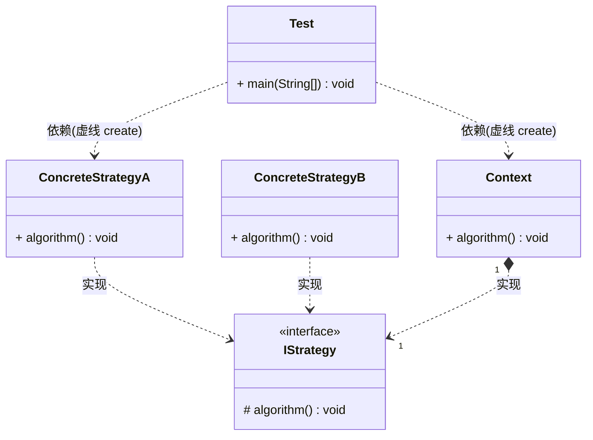

### 策略模式（Strategy Pattern）

又称为政策模式（Policy Pattern）它是将定义好的算法家族，分别封装起来，让他们之间可以相互替换，从而让算法的变化不会影响到使用算法的用户。属于行为型模式

> 策略模式使用的就是面向对象的继承和多态机制， 从而实现同一个行为在不同的场景下具备不同的实现。

### 生活中的策略模式

交税逻辑： 每个人会根据自己不同的收入水平进行不同的税收逻辑，每一种逻辑则是一种策略。

### 角色与UML

* 上下文角色（Context）: 用来操作策略的上下文环境，屏蔽高层模块对策略，算法的直接访问， 封装可能存在的变化；
* 抽象策略角色（Strategy）: 规定策略或算法的行为；
* 具体策略角色（ConcreteStrategy）: 具体的策略或者算法实现

> 上下文环境（Context）其职责本来是隔离客户端与策略类的耦合， 让客户端完全与上下文环境沟通，无需关系具体策略

