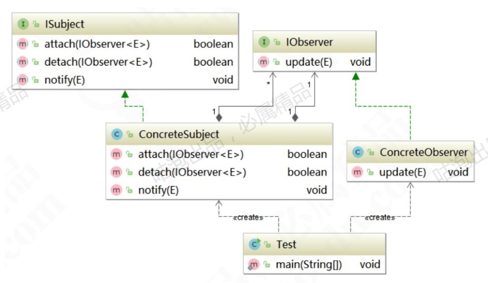

### 观察者模式（Observer Pattern）

> 参考文档： [观察者模式与访问者模式详解.pdf](source/观察者模式与访问者模式详解.pdf) 

又称订阅-发布模式（Publish/Subscribe），模型-视图模式（Model/View），源-监听模式（Source/Listener），从属者模式（Dependents）。定义一种一对多的依赖关系， 一个主题对象可被多个观察者对象同事监听， 使得每当主体对象状态变化时， 所有依赖于它的对象都会得到通知， 并自动更新。属于行为型模式

> 观察者模式的核心是将观察者与被观察者解耦， 以类似于消息广播发送的机制联动两者， 使被观察者的变动能通知到感兴趣的观察者们，从而做出相应的相应。
>
> 优点：
>
> 1. 观察者与被观察者松耦合， 符合依赖倒置原则。
> 2. 建立一套触发机制， 使得数据的变化可以响应到多个表示层上
> 3. 实现了一对多的通讯机制，支持事件注册
>
> 缺点：
>
> 1. 如果观察者数量过多， 则事件通知会耗时较长
> 2. 事件通知呈线性关系， 如果其中一个观察者处理时间卡主， 影响其他事件。
> 3. 如果观察者与被观察者存在循环依赖， 则可能会造成两者之间的循环调用。

### 角色与类图

* 抽象主题（Subject）：指被观察者对象（Observable）该角色是一个抽象类或者接口， 定义了增加删除， 通知观察者对象的方法
* 具体主题（ConcreteSubject）： 具体被观察者， 当期内状态变化时，会通知已经注册的观察者；
* 抽象观察者（Observer）： 定义了相应通知的更新方法
* 具体观察者（ConcreteObserver）： 在得到状态更新时， 会自动做出相应。

### 源码中的观察者

* Spring中的ContextLoaderListener实现了ServletContextListener接口，ServletContextListener接口又继承了EventListener，在JDK中EventListener有非常广泛的应用。