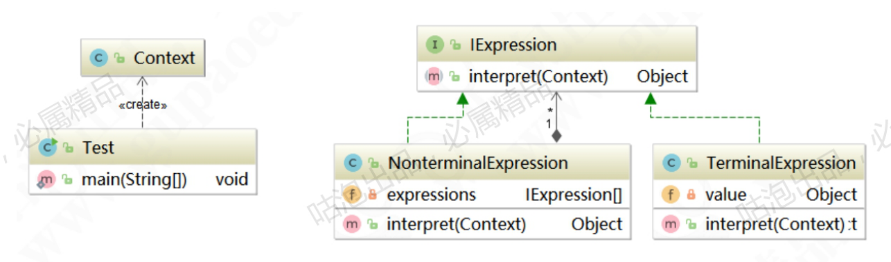

### 解释器模式（Interpreter Pattern）

> 参考文档： [中介者模式与解释器模式详解.pdf](source/中介者模式与解释器模式详解.pdf) 

是指给定一门语言，定义它的文法的一种表示，并定义一个解释器， 该解释器使用该表示来解释语言中的句子， 是一种按照规定的语法进行解析的模式， 属于行为型模式。

> 优点：
>
> 1. 扩展性强
> 2. 增加了新的解释表达式的方式
> 3. 易于实现文法
>
> 缺点：
>
> 1. 语法规则复杂是会引起类膨胀
> 2. 执行效率低

### 角色与UML

* 抽象表达式（Expression）：负责定义一个解释方法interpret， 交由具体的子类进行具体解释
* 终结符表达式（TerminalExpression）： 实现文法中终结符有关的解释操作。
* 非终结符表达式（NonterminalExpression）：实现文法中与非终结符有关的解释操作。
* 上下文类（Context）：包含解释器之外的全局信息。

### 源码中的解释器而是

* JDK源码中的Pattern
* Spring中的ExpressionParser