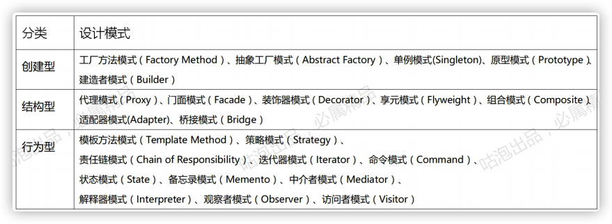

### 总结设计模式

> 参考文档： [各设计模式总结与对比.pdf](source/各设计模式总结与对比.pdf) 

列举所有设计模式(23)

* 创建型
    1. **简单工厂模式**
    2. **抽象工厂模式**
    3. **单例模式**
    4. 原型模式
    5. **建造者模式**
* 结构型
    1. **代理模式**
    2. **门面模式**
    3. **装饰器模式**
    4. **享元模式**
    5. **组合模式**
    6. **适配器模式**
    7. 桥接模式
* 行为型
    1. **模板模式**
    2. **策略模式**
    3. **责任链模式**
    4. 迭代器模式
    5. 命令模式
    6. **状态模式**
    7. 备忘录模式
    8. 中介模式
    9. 解释器模式
    10. 观察者模式
    11. 访问者模式

### 记忆地图

