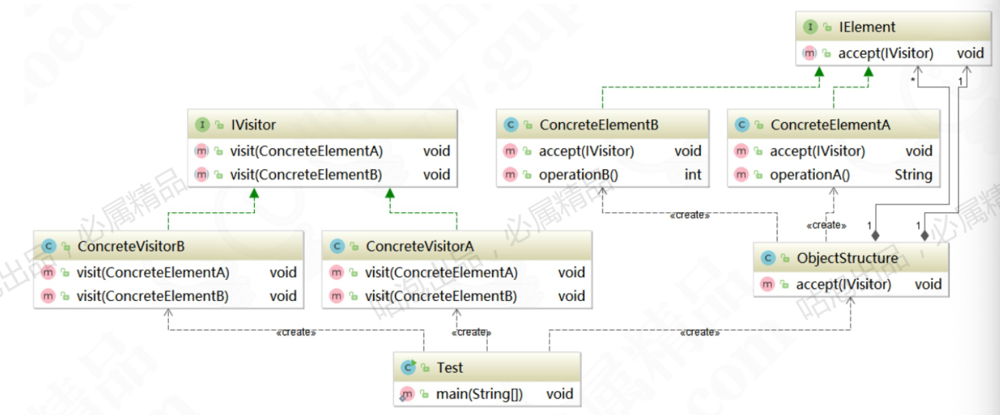

### 访问者模式（Visitor Pattern)

> 参考文档： [观察者模式与访问者模式详解.pdf](source/观察者模式与访问者模式详解.pdf) 

将数据结构与数据操作分离的设计模式，是指封装一些作用域某种数据结构中的各元素的操作。它可以在不改变数据结构的前提下定义作用域这些元素的新的操作，属于行为型模式

> 优点：
>
> 1. 解耦了数据结构与数据操作， 使得操作集合可以独立变化
> 2. 扩展性好： 可以通过扩展访问者角色， 实现对数据集合的不同操作
> 3. 元素具体类型并非单一， 访问者均可操作
>
> 个角色职责分离，符合单一职责原则
>
> 缺点：
>
> 1. 无法增加平素类型： 若系统数据结构对象易于变化， 经常有新的数据对象增加进来， 则访问者类必须增加对应元素类型的操作， 违背了开闭原则
> 2. 具体元素变更困难：具体元素增加属性， 删除属性等操作会导致对应的访问者类需要进行相应的修改， 尤其当有大量访问者类时， 修改范围太大
> 3. 违背依赖倒置原则：为了到达区别对待， 访问者依赖的是具体元素类型， 而不是抽象。

### 角色与类图

* 抽象访问者（Visitor）： 接口或者抽象类。
* 具体访问者（ConcreteVisitor）： 实现对具体元素的操作
* 抽象元素（Element）： 接口或者抽象类
* 具体元素（ConcreteElement）： 具体元素类型
* 结构对象（ObjectStructure）： 该类内部维护了元素集合，并提供方法接受访问者对该集合的元素进行访问

### 从静态分派到动态分派

### 访问者中的伪动态双分派

### 源码中的访问者模式

* JDK中NIO模块下的FilVisitor

