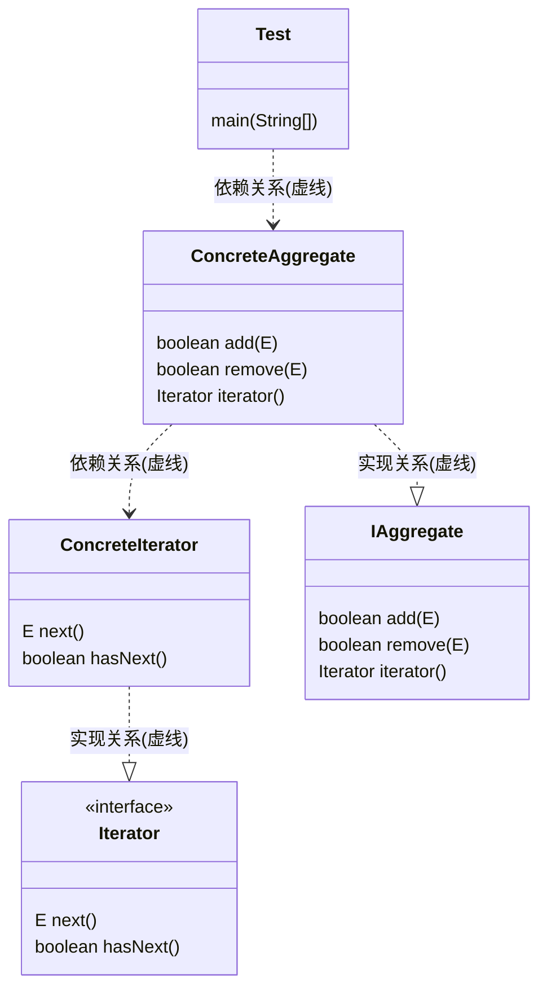

### 迭代器模式(Iterator Pattern)

又称<kbd>游标模式(CUrsor Pattern)</kbd>,他提供一种顺序访问集合/容器对象元素的方法.而又无需暴露集合内部表示.可以为不同容器提供一致的遍历行为, 而不用关心容器内容元素组成结构, 属于行为型模式.

> 迭代器模式的本质是: 抽离集合对象迭代行为到迭代器中, 提供一致访问接口.
>
> 优点: 
>
> 	1. 多态迭代: 为不同的聚合结构提供一致的遍历接口, 即一个迭代接口可以访问不同的集合对象.
>  	2. 简化集合对象接口: 迭代器模式将集合对象本身应该提供的与元素迭代接口抽象到了迭代器中, 使集合对象无需关心具体迭代行为.
>  	3. 元素迭代功能多样化, 实现多态.
>  	4. 解耦迭代与集合
>
> 缺点:
>
> ​	1. 对于比较简单的遍历, 使用迭代器方法遍历比较繁琐

### 生活中的迭代器

* 物流的传送带一个一个处理上面的包裹
* 地铁进站需要一个一个人依次刷卡

### 角色与UML

* 抽象迭代器(Iterator): 抽象迭代器负责定义访问和遍历元素的接口
* 具体迭代器(ConcreteIterator): 提供具体的元素遍历行为
* 抽象容器(Aggregate):负责定义提供具体迭代器的接口;
* 具体容器(ConcreteAggregate): 创建具体迭代器

### 源码中的迭代器

* JDK中的Iterator

